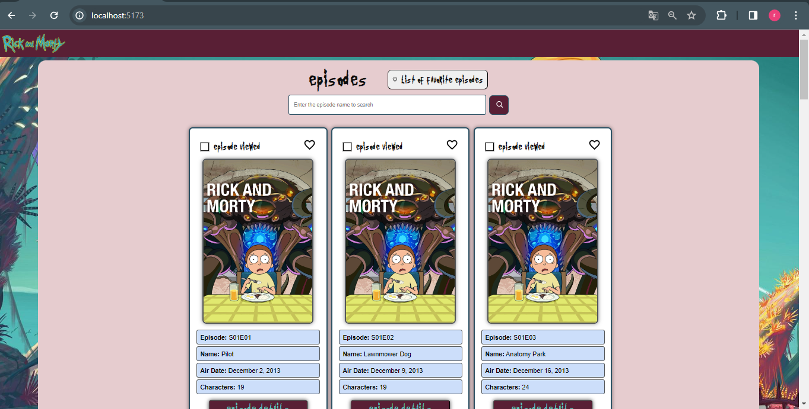
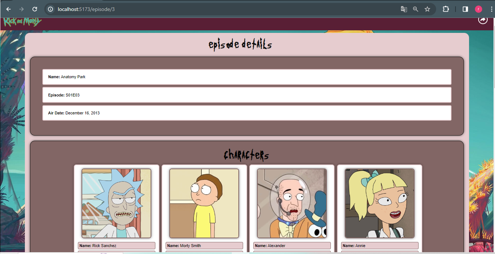

  

# Desafio React 👨🏽‍💻✔

Criar uma aplicação Web em ReactJS para gerenciar todos os episódios de Rick
and Morty.
 

## Requisitos 📝
- [x] Listar todos os episódios e exibir os seus dados
- [x] Detalhar o episódio, nessa tela deve mostrar as características do episodio e as informações sobre cada personagem do episódio com os seus dados
- [x] Funcionalidade de Favoritar e Desfavoritar um episódio
- [x] Funcionalidade de Marcar um episódio como Visto
- [x] Funcionalidade de Listar episódios favoritos
- [x] Funcionalidade d Buscar episódio pelo nome 
- [x] Responsividade da aplicação

### Preview da página Home da aplicação - Episódios 🎞

  

### Preview página de Detalhes do Episódio 🎞🔍

  

## Utilizei o Vite para criar a aplicação React 🏗
> Passos para rodar a aplicação:
- [x] Direcione o caminho do seu terminal até a pasta principal do projeto: <strong>Frontend</strong>
- [x] Instale as dependências com o comando <strong>'npm install'</strong>
- [x] Na pasta <strong>Frontend</strong> digite o comando <strong>'npm run dev'</strong> para dar o start na aplicação (renderizar)

## Tecnologias 🛠
- React
- TypeScript
- CSS

## Desenvolvedor 👨🏽‍💻

- <a target="_blank" href="https://www.linkedin.com/in/ramon-barreto-medrado/">Ramon Barreto</a>

